<div align="center">

# COVID-19 Global Intelligence

### Turning reported pandemic data into an interactive analytical story

<p>
  
  
  
  
  
</p>

<p>
  <b>209 countries / regions</b> &nbsp; · &nbsp;
  Country and regional analysis &nbsp; · &nbsp;
  Time series analysis &nbsp; · &nbsp;
  Interactive geographic analysis
</p>

</div>

---
## Live Dashboard

<p align="center">

<a href="https://covid-19-global-intelligence-analytical-dashboard.streamlit.app/">


</a>

</p>

<p align="center">
Explore the interactive COVID-19 Global Intelligence dashboard.
</p>

The live application provides an interactive analytical experience covering global pandemic trends, geographic distribution, country comparisons, regional intelligence, impact analysis, testing relationships, and mortality analysis.

**Live Dashboard:**  
https://covid-19-global-intelligence-analytical-dashboard.streamlit.app/


## Visual Analytics

The project combines structured data analysis with interactive visualizations to examine COVID-19 patterns across time, geography, impact, testing, mortality, and regional differences.

### Global Pandemic Evolution

<p align="center">
  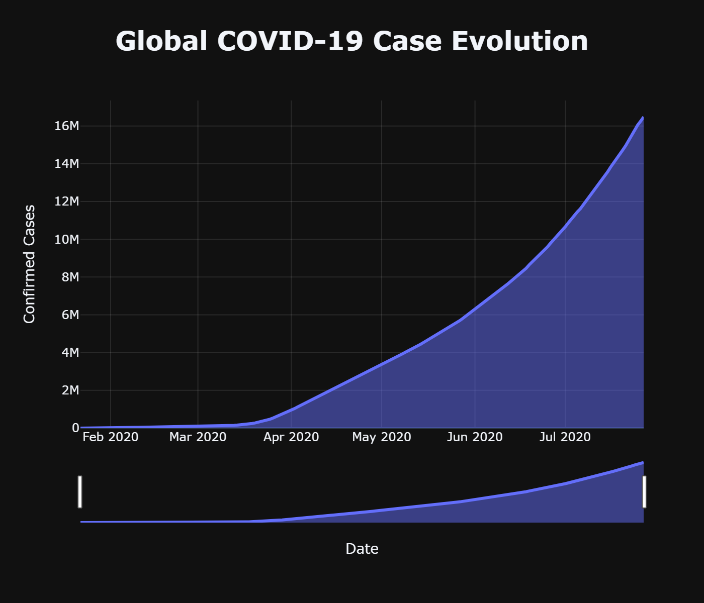
</p>

<p align="center">
  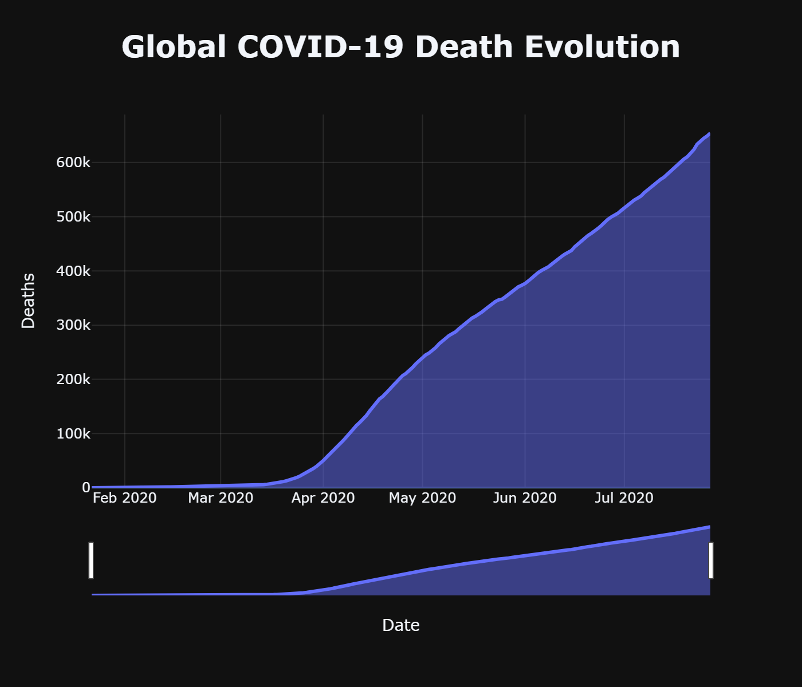
</p>

<p align="center">
  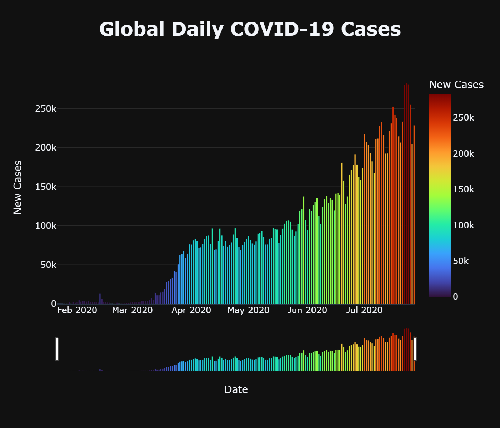
</p>

The temporal analysis examines how reported cases, deaths, and daily case activity changed across the available observation period.

### Country and Geographic Analysis

<p align="center">
  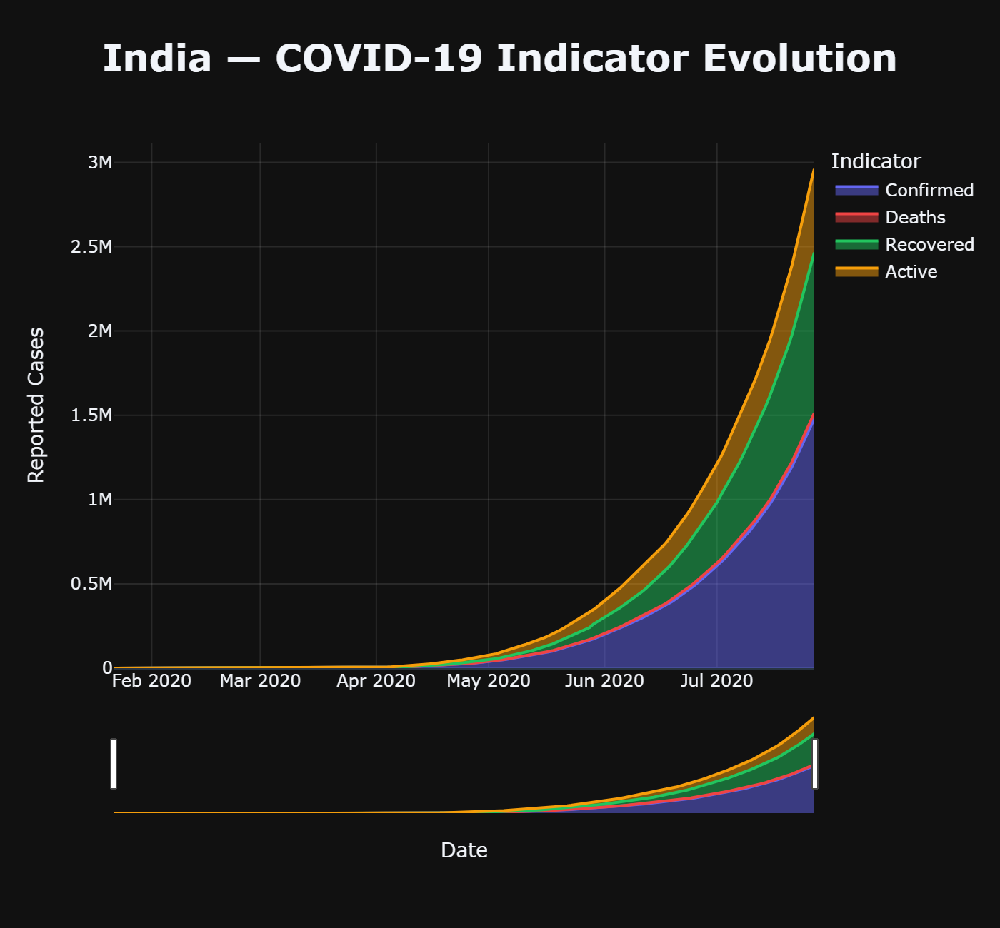
</p>

<p align="center">
  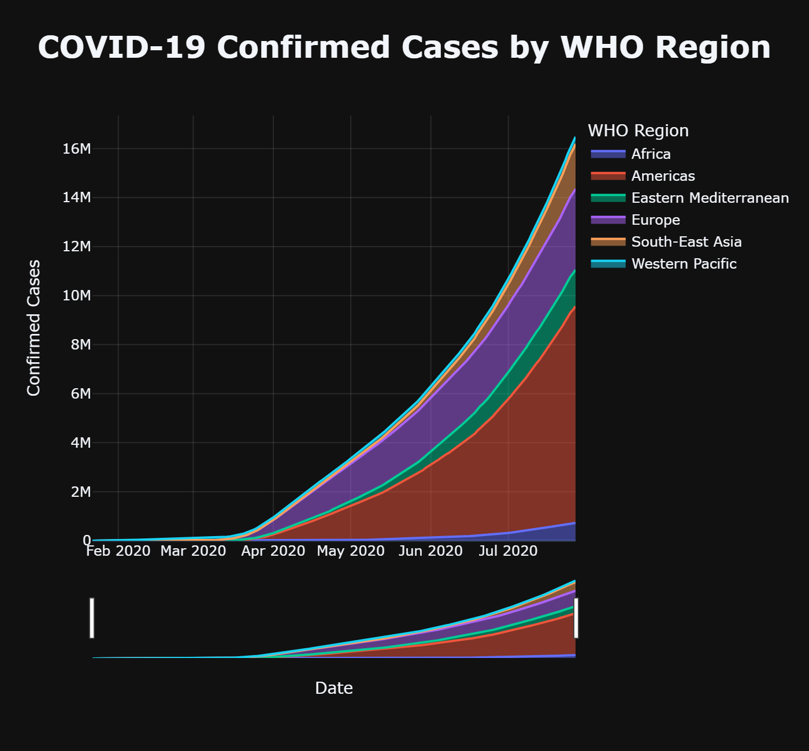
</p>

<p align="center">
  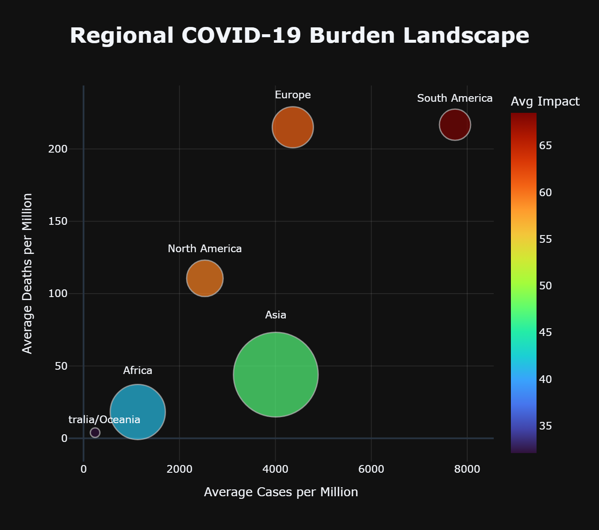
</p>

The geographic analysis compares reported COVID-19 indicators across countries and regional groups.

### COVID-19 Impact Intelligence

<p align="center">
  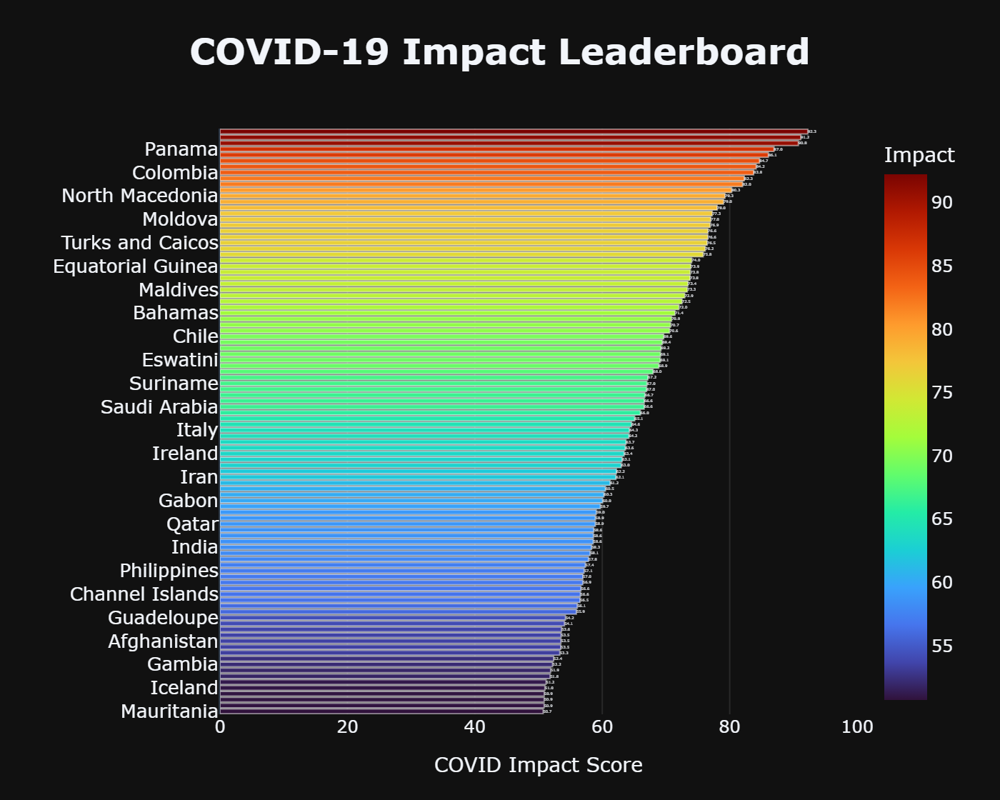
</p>

The impact analysis provides a comparative country-level view using the project's calculated COVID-19 Impact Score.

The score is a project-defined analytical construct created for comparative exploration. It is not an official epidemiological or public health severity index.

### Testing and Case Burden

<p align="center">
  
</p>

The analysis compares testing intensity with reported cases using population-normalized indicators.

The relationship is descriptive and should not be interpreted as evidence of causation.

### Case Burden and Mortality

<p align="center">
  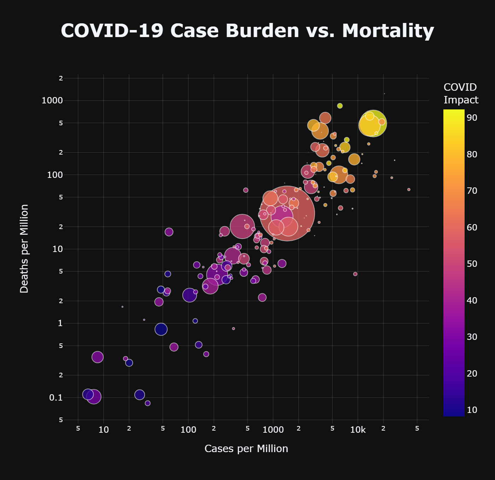
</p>

The burden analysis compares reported cases per million with reported deaths per million to provide a population-normalized perspective across countries.

### Additional Analytical Views

<p align="center">
  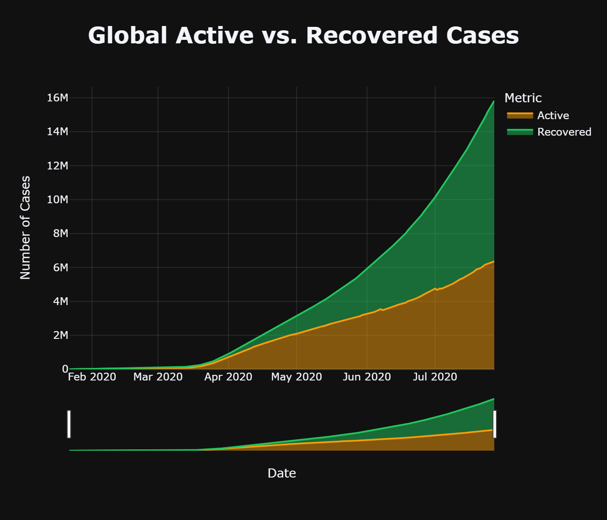
</p>

<p align="center">
  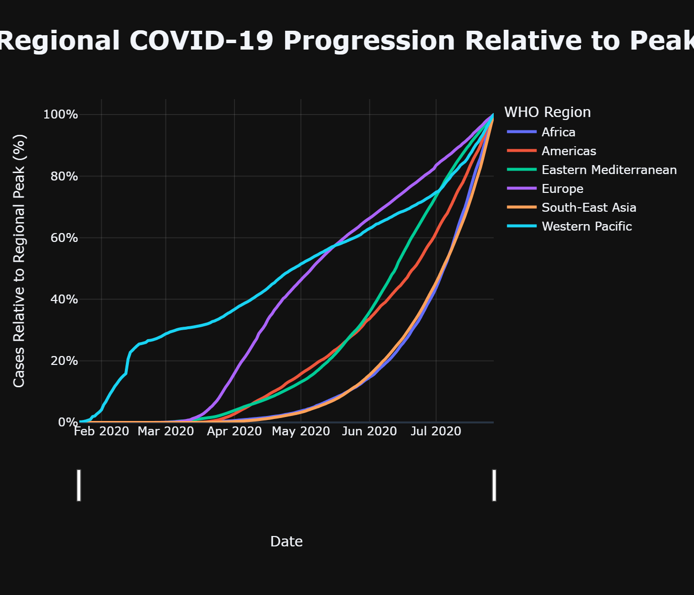
</p>

<p align="center">
  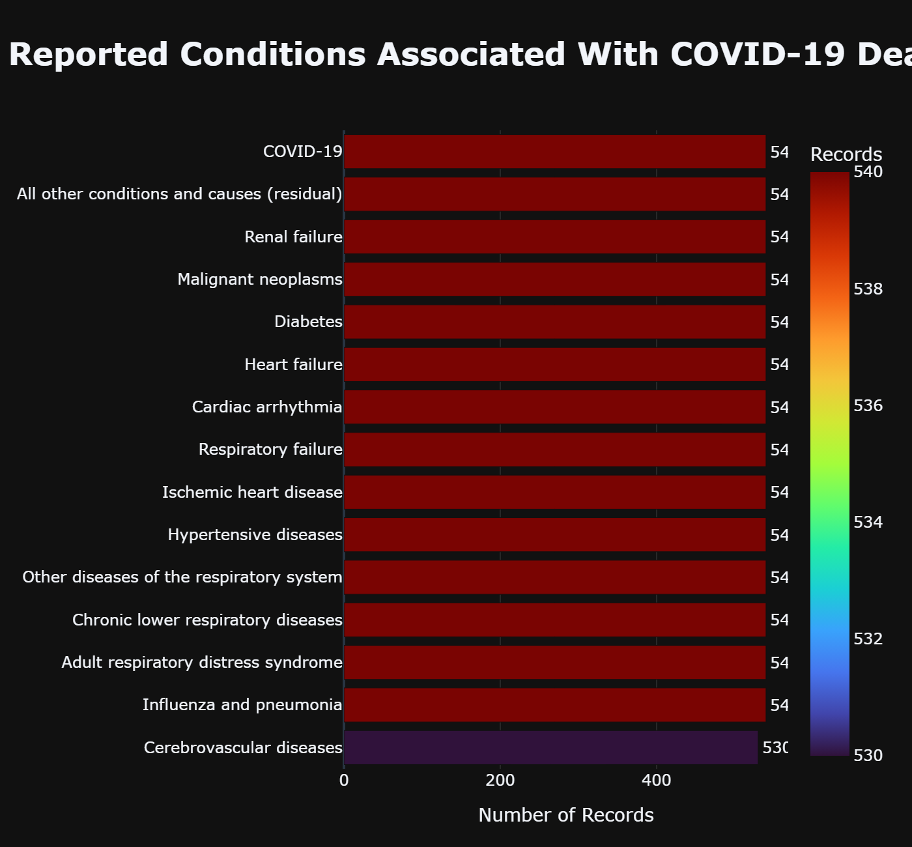
</p>

These additional visualizations support deeper exploration of recovery patterns, regional progression, and other reported indicators represented in the analytical dataset.

## Executive Overview

**COVID-19 Global Intelligence** is an end to end **Data Analytics project** that transforms reported COVID-19 records into an interactive analytical dashboard.

The project combines a structured Jupyter Notebook workflow with a Streamlit application to investigate:

- reported COVID-19 burden across countries
- changes across the available observation period
- differences between regions
- population normalized indicators
- testing intensity and reported case burden
- reported case burden and mortality
- country comparisons using a project defined impact framework

The objective is to move from **data to analysis to evidence to visual communication**.

## Analytical Story

The project is organized around four analytical perspectives:

| Perspective | Analytical focus |
|---|---|
| **Time** | How did reported burden change across the available observation period? |
| **Geography** | Where was reported burden concentrated across countries and regions? |
| **Relationships** | How were testing, reported cases and mortality associated in the available records? |
| **Impact** | How can countries be comparatively grouped using the project's calculated impact framework? |

This structure keeps the dashboard focused on analytical questions instead of simply presenting a collection of charts.

## Dashboard

The Streamlit application brings the analytical work into one interactive interface.

It provides:

- Global overview
- Key reported metrics
- Global pandemic evolution
- Interactive geographic analysis
- Impact analysis
- Country rankings
- Regional comparisons
- Testing analysis
- Mortality analysis
- Analytical explanations
- Dataset scope and limitation messaging

Run the dashboard locally with:

```bash
streamlit run app.py
```

## Global Snapshot

The dashboard provides a high level view of the country level records represented in the dataset.

Key metrics include:

- Countries and regions represented
- Reported cases
- Reported deaths
- Reported recoveries
- Active cases

These values are intentionally described as **reported values** rather than complete historical pandemic totals.

## Pandemic Evolution

The time series analysis examines the reported global trajectory across the available observations.

It provides context for:

- cumulative reported cases
- reported deaths
- reported recoveries
- active cases
- daily reported case activity

The analysis is descriptive. It identifies patterns present in the dataset without claiming causal explanations for those changes.

## Global Pandemic Footprint

The interactive choropleth map allows users to explore the geographic distribution of:

- Reported Cases
- Reported Deaths
- Reported Recoveries
- Active Cases

The selected metric can be changed from the dashboard controls.

The map is designed as an analytical comparison tool rather than a static geographic visualization.

## Impact Intelligence

The project includes a calculated **COVID-19 Impact Score** built from selected burden indicators.

The framework supports:

- comparative country ranking
- impact category distribution
- country level impact exploration

Impact categories include:

`Low` · `Moderate` · `High` · `Critical`

The Impact Score is a project defined analytical construct. It is **not an official epidemiological, medical or public health severity index**.

## Regional Intelligence

Country level records are aggregated into broader geographic groups to examine regional differences.

The analysis considers:

- total reported cases
- total reported deaths
- active cases
- recoveries
- population
- number of represented countries
- average cases per million
- average deaths per million
- average calculated impact score

This provides a regional perspective alongside the country level analysis.

## Testing Intelligence

The testing analysis examines:

**Tests per Million vs Reported Cases per Million**

A Pearson correlation is used to quantify the linear association visible in the available records.

A correlation describes statistical association. It does not establish causation.

The dashboard therefore avoids interpreting this relationship as proof that testing caused reported case levels to change.

## Pandemic Burden Matrix

The burden matrix compares:

**Reported Cases per Million vs Reported Deaths per Million**

Population normalized measures help reduce the distortion that can occur when comparing countries with substantially different population sizes.

The calculated impact score provides an additional analytical dimension.

## Country Intelligence

The country ranking section allows users to explore countries using different analytical metrics.

Available ranking perspectives include:

- Reported Cases
- Reported Deaths
- Reported Recoveries
- Active Cases
- Calculated Impact Score

## Data and Scope

The final analytical dataset covers:

**209 countries / regions**

The dashboard uses the actual observation period represented in the source time series.

The project does not claim to represent the complete historical COVID-19 pandemic.

Reported values can be influenced by differences in:

- testing practices
- reporting practices
- definitions
- update timing
- data availability

For this reason, the dashboard explicitly communicates its dataset scope and limitations.

## Analytical Workflow

```text
Source Data
    |
    v
Data Inspection and Cleaning
    |
    v
Feature Engineering
    |
    v
Population Normalized Indicators
    |
    v
Impact Framework
    |
    v
Country and Regional Analysis
    |
    v
Relationship Analysis
    |
    v
Interactive Visualizations
    |
    v
Streamlit Dashboard
```

## Data Analytics Techniques

### Data Preparation

- Data loading
- Data type handling
- Missing value handling
- Duplicate and consistency checks
- Data standardization

### Exploratory Analysis

- Descriptive statistics
- Aggregation
- Distribution analysis
- Country ranking
- Regional comparison
- Time series analysis

### Feature Engineering

- Cases per million
- Deaths per million
- Mortality rate
- Burden indicators
- Calculated Impact Score
- Impact categories

### Relationship Analysis

- Pearson correlation
- Scatter analysis
- Population normalized comparison

### Data Visualization

- Interactive choropleth maps
- Time series charts
- Bar charts
- Bubble charts
- Scatter plots
- Impact distributions
- Interactive ranking views

### Dashboard Development

- Streamlit
- Interactive controls
- Dynamic metric selection
- Analytical explanations
- Dataset limitation messaging

## Technology Stack

| Technology | Purpose |
|---|---|
| **Python** | Core analytical language |
| **Pandas** | Data cleaning, transformation and aggregation |
| **NumPy** | Numerical calculations |
| **Plotly** | Interactive charts and maps |
| **Matplotlib** | Notebook visualizations |
| **WordCloud** | Exploratory notebook visualization |
| **NBFormat** | Notebook related processing |
| **Streamlit** | Interactive dashboard |
| **Jupyter Notebook** | Analytical workflow |

## Repository Structure

```text
COVID-19-Global-Intelligence/
|
├── data/
│   ├── raw/
│   └── processed/
|
├── notebooks/
│   └── COVID-19 Data Analysis.ipynb
|
├── assets/
|
├── app.py
├── requirements.txt
├── README.md
└── .gitignore
```

## Notebook to Dashboard

The analytical notebook and Streamlit application serve different purposes.

### Jupyter Notebook

The notebook demonstrates:

**data cleaning → transformation → analysis → visualization → insights**

### Streamlit Dashboard

The application demonstrates:

**interaction → exploration → communication**

Keeping both components in the repository makes the analytical process transparent while also demonstrating the ability to turn analysis into an interactive application.

## Limitations and Responsible Interpretation

### Dataset Coverage

The analysis is limited to the records and observation period available in the source dataset.

### Reported Figures

Reported values can be affected by differences in testing coverage, reporting practices, definitions, timing and data availability.

### Impact Score

The COVID-19 Impact Score is a project specific analytical framework created for comparative exploration. It is not an official public health or epidemiological measure.

### Correlation and Causation

Relationship charts show statistical association within the available records. They do not establish causal relationships.

### Interpretation

The findings describe patterns in the dataset. They should not be interpreted as medical advice, epidemiological proof or causal explanations.

## Key Analytical Perspectives

The project demonstrates several practical analytical insights:

- Raw totals can be misleading when countries have very different populations.
- Population normalized indicators provide a stronger basis for cross country comparison.
- Countries and regions can display very different combinations of reported case burden and mortality burden.
- Testing intensity and reported case burden can be examined together without assuming a causal relationship.
- A structured impact framework can support consistent comparative analysis when its assumptions are clearly documented.
- Dataset limitations are an important part of interpreting real world analytical results.

## Future Scope

Potential extensions include:

- Additional validated data sources
- Extended observation periods
- Automated data refresh workflows
- More detailed geographic drill downs
- Additional reliable demographic or healthcare indicators
- More granular time series comparisons

These improvements are outside the current project scope.

## Run Locally

### Clone the repository

```bash
git clone https://github.com/YOUR_USERNAME/COVID-19-Global-Intelligence.git
cd COVID-19-Global-Intelligence
```

### Create a virtual environment

Windows:

```bash
python -m venv .venv
.venv\Scripts\activate
```

macOS or Linux:

```bash
python3 -m venv .venv
source .venv/bin/activate
```

### Install dependencies

```bash
pip install -r requirements.txt
```

### Launch the dashboard

```bash
streamlit run app.py
```

## Project Positioning

This project is intentionally positioned as a **Data Analytics project** rather than a machine learning prediction project.

It demonstrates practical experience with:

- Data cleaning
- Exploratory data analysis
- Feature engineering
- Data aggregation
- Comparative analysis
- Relationship analysis
- Data visualization
- Analytical storytelling
- Interactive dashboard development

## Author

**Archi Yadav**

---

<div align="center">

### COVID-19 Global Intelligence

**Python · Pandas · NumPy · Plotly · Streamlit**

Turning reported data into understandable analytical evidence

</div>
